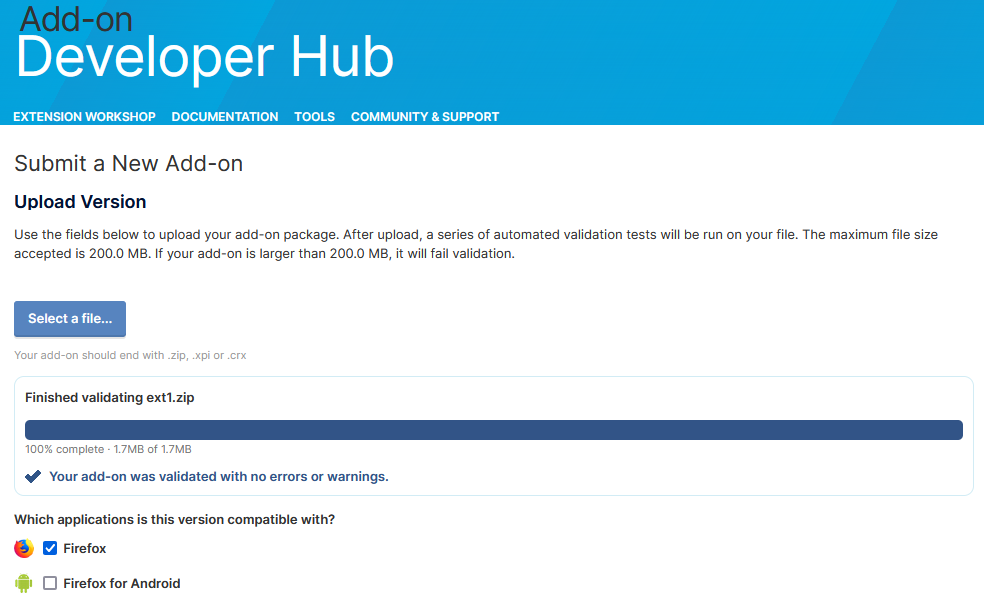

# **Phase 1: Basic Random Background on New Tab**
[zip](https://github.com/mattwydra/newtab-background/blob/main/v1/ext1.zip)

### **Objective:**
- Load a random background image every time a new tab is opened.
- Select the background from a predefined list or folder.

### **Implementation:**
- Create an array of background images.
- Use JavaScript to randomly select an image and apply it as the background.
- Ensure the background covers the entire screen.

### **Code Implementation:**
```javascript
const wallpapers = ["wallpapers/guts2.jpg", "wallpapers/guts.jpg"];

function setRandomBackground() {
    const randomImage = wallpapers[Math.floor(Math.random() * wallpapers.length)];
    document.body.style.background = `url('${randomImage}') no-repeat center center fixed`;
    document.body.style.backgroundSize = "cover";
}

document.addEventListener("DOMContentLoaded", setRandomBackground);
```


# Firefox Validation:
I'm still quite new to writing and publishing browser extensions, so use these at your own risk. However, I have tested all of the zips by uploading them to Firefox and running them through the Firefox validator. I can show the proof that they are considered safe (without errors and without warnings):

