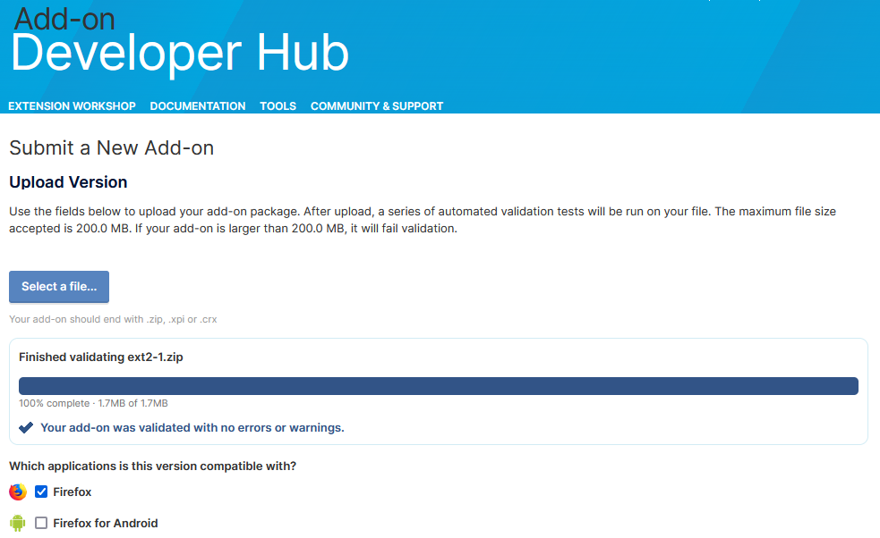

# **Phase 2: Background Rotation (Auto-Switch Every 10s)**
[zip](https://github.com/mattwydra/newtab-background/blob/main/v2/ext2-1.zip)

### **Objective:**
- Rotate the background image every 10 seconds.
- Optimize performance so it only updates if the tab is active.

### **Implementation:**
- Use `setInterval` to change the background at intervals.
- Check tab visibility before changing the image to prevent unnecessary updates.

### **Code Implementation:**
```javascript
function startBackgroundRotation() {
    setInterval(() => {
        if (!document.hidden) {
            setRandomBackground();
        }
    }, 10000);
}

document.addEventListener("DOMContentLoaded", startBackgroundRotation);
```


# Firefox Validation:
I'm still quite new to writing and publishing browser extensions, so use these at your own risk. However, I have tested all of the zips by uploading them to Firefox and running them through the Firefox validator. I can show the proof that they are considered safe (without errors and without warnings):

