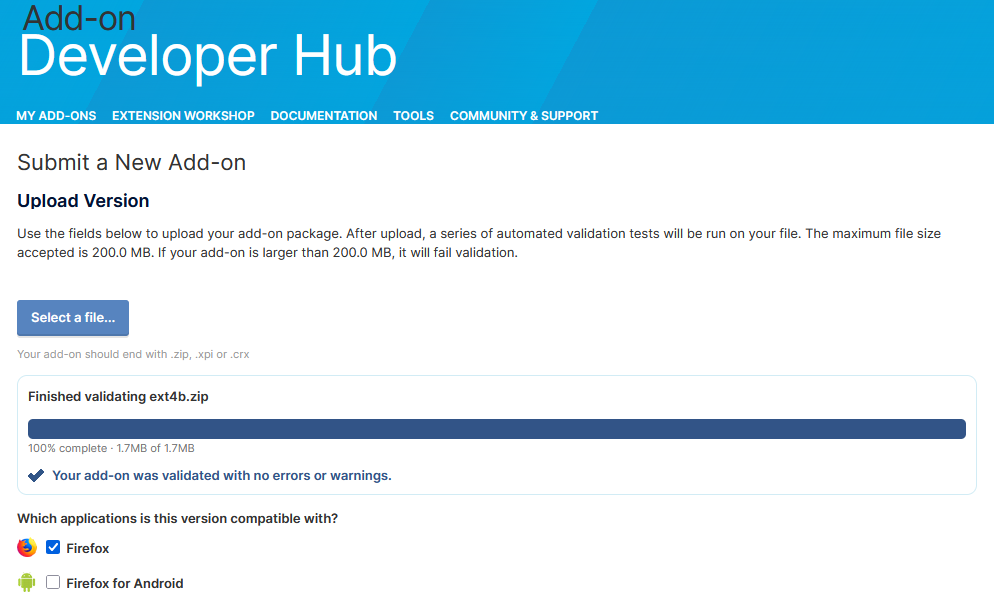

# Phase 4b
Version 4b [zip](https://mattwydra.github.io/newtab-background/v4/v4b/ext4b.zip)

## Overview
This is an improved version of the custom new tab page, featuring categorized site bookmarks, a dynamic background, and a custom bookmark section. This version refines and extends the functionality of Version A with several key enhancements.

## Differences from Version A
- **Category-Based Navigation:**
  - Users can switch between `Productivity`, `Gaming`, `Media`, and `Custom` site lists.
  - Each category displays a unique set of predefined links.
- **Improved Background Management:**
  - The background changes every 10 seconds from a predefined set of wallpapers.
- **Expanded Predefined Sites:**
  - Additional commonly used websites are included in the predefined site lists.
- **Custom Bookmarks Support:**
  - Users can add custom bookmarks that persist using `localStorage`.
  - The custom category dynamically updates when new sites are added.
- **Refactored JavaScript Code:**
  - Improved event listeners for category switching.
  - Functions for rendering sites and adding custom sites are more modular.

## Features
- **Search Bar:** Placeholder input for future search integration.
- **Favicon Display:** Uses Google’s favicon API to display icons next to site links.
- **Dynamic UI Updates:** Clicking a category updates the displayed links dynamically without a page reload.
- **Minimalist Design:** A simple and clean user interface.

## Setup
1. Clone or download the repository.
2. Place the files in a directory.
3. Open `index.html` in a browser.
4. Ensure the `newtab.js` script is correctly linked.

## Potential Enhancements
- Implementing a real search functionality.
- Adding an editable option for backgrounds.
- Syncing custom bookmarks across devices using cloud storage.
- Customization settings for category organization.

This version refines the user experience while keeping the core functionality of Version A intact, making it a more user-friendly and flexible new tab replacement.

# Firefox Validation:
I'm still quite new to writing and publishing browser extensions, so use these at your own risk. However, I have tested all of the zips by uploading them to Firefox and running them through the Firefox validator. I can show the proof that they are considered safe (without errors and without warnings):

