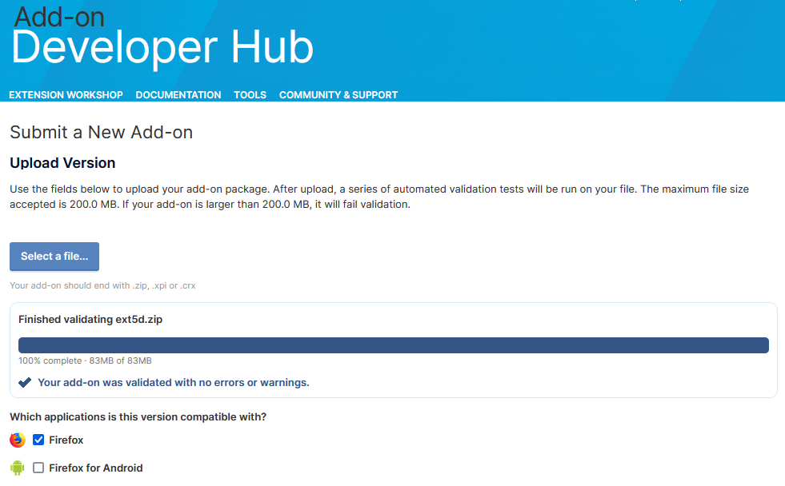

# Phase 5d
Version 5d [zip](https://mattwydra.github.io/newtab-background/v5/v5d/ext5d.zip)

## **Objective:**
- Add more sites to the presets
- Allow for adding/removing from presets
- Will support more options:
   - hide bookmarks (done)
   - hide individual elements (search bar, sites, etc.)
   - add images (or videos/gifs, etc.)
   - add quotes

# Firefox Validation:
I'm still quite new to writing and publishing browser extensions, so use these at your own risk. However, I have tested all of the zips by uploading them to Firefox and running them through the Firefox validator. I can show the proof that they are considered safe (without errors and without warnings):

